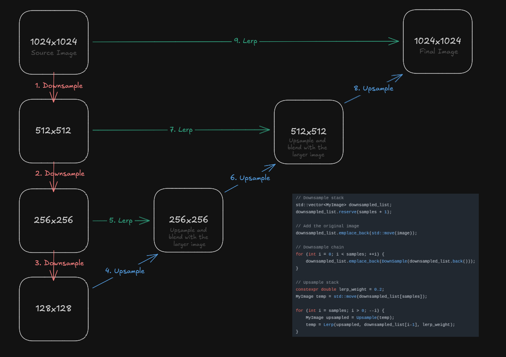
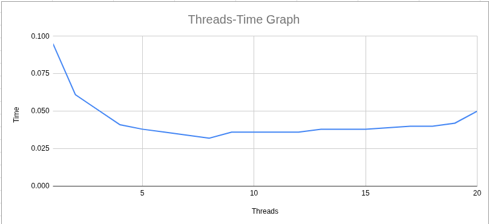

# CoD Bloom Effect on CPU

Implementing a bloom effect on CPU for learning purposes.

## Result


## The Algorithm

As can be seen from the diagram below, we start by downsampling the original image multiple times while storing them in a list. then we take the smallest image and upsample it to be the same size as the previous (larger) image aka the image that has been downsampled one less time.
Now that we have two images of the same size (e.g. 256x256 and 256x256) we mix them together. Here we use a simple lerp with alpha=0.2. We continue until we get the final image.



A few notes:
- Bilinear tap is retrieving the bilinear interpolation of the 4 closest pixels around a target point (x, y). x and y are float values between 0-1 but we need to find their 4 nearest pixels and blend their values based on their distance to (x,y). See https://github.com/Gholamrezadar/bloom_cpp/blob/560ed060b5cbf32fc44052eaf1458ec1890ed821/src_shit/main.cpp#L36
- Downsampling is done by calculating the weighted sum of bilinear taps at 13 predefined points each with predefined weights. See https://github.com/Gholamrezadar/bloom_cpp/blob/560ed060b5cbf32fc44052eaf1458ec1890ed821/src_shit/main.cpp#L124
  
- Upsampling is done similarly but using 9 points with predefined weights. See https://github.com/Gholamrezadar/bloom_cpp/blob/560ed060b5cbf32fc44052eaf1458ec1890ed821/src_shit/main.cpp#L76
- The blending of downsampled and upsampled images look like this:
  ```
  B-E are downsampled versions of the original image (A)
  then upsampling:
  
  E' = E
  D' = lerp(D, E', 0.2)
  D' = lerp(C, D', 0.2)
  D' = lerp(B, C', 0.2)
  A' = lerp(A, B', 0.2)
  
  A' is the result
  ```

## Performance Comparison

Measured on an Intel i7-12700 CPU

| Implementation       | time       | fps       |
| -------------------- | ---------- | --------- |
| Python               | 39.5 secs  | 0.025 fps |
| C++ (Debug)          | 2.7 secs   | 0.37 fps  |
| C++ (Release)        | 0.68 secs  | 1.47 fps  |
| C++ (Improved)       | 0.11 secs  | 9 fps     |
| C++ (Multithread 8t) | 0.032 secs | 31 fps    |
| OpenGL               | ? secs     | ? fps     |

Note: Change ${SRC_DIR} in CMakeLists.txt to compile other versions of the code.

## Performance Improvements

I tried different approaches to improve performance, here I list them for future reference. (CPU: i7-4930k)

| Technique                                                 | Time      | Speedup |
| --------------------------------------------------------- | --------- | ------- |
| Baseline                                                  | 3.05 secs | 1x      |
| Flat vector instead of 3D vector                          | 1.30 secs | 2.3x    |
| Inline the GetPixel and SetPixel                          | 1.08 secs | 2.82x   |
| Flat Lerp instead of 3D Lerp                              | 1.06 secs | 2.87x   |
| Arithmetic Optimisations in BilinearTap                   | 0.98 secs | 3.11x   |
| static const double arrays instead of vectors for weights | 0.94 secs | 3.24x   |
| Avoid divisions in the inner-loop                         | 0.87 secs | 3.50x   |
| std::move and emplace_back                                | 0.81 secs | 3.76x   |
| Claude's version                                          | 0.72 secs | 4.23x   |
| OpenMP Multithread with 10 threads (Claude)               | 0.16 secs | 19x     |

### 1. Flat vector instead of 3D vector

This improved the performance from `3.05` secs to `1.30` secs per 1024x1024 image.

From

```cpp
std::vector<std::vector<std::vector<double>>> pixels;
```

```cpp
double GetPixel(int x, int y, int channel) const{
    return data[y][x][channel];
}

void SetPixel(int x, int y, int channel, double value) {
    data[y][x][channel] = value;
}
```

To

```cpp
std::vector<double> pixels;
```

```cpp
double GetPixel(int x, int y, int channel) const{
    return data[y * width + x * channels + channel];
}
void SetPixel(int x, int y, int channel, double value) {
    data[y * width + x * channels + channel] = value;
}
```

### 2. Inline GetPixel and SetPixel

GetPixel and SetPixel are called very often, let's reduce the number of function calls.

This improved the performance from `1.30` secs to `1.08` secs per 1024x1024 image.

### 3. Flat Lerp instead of 3D Lerp

This didn't help that much.

From

```cpp
MyImage Lerp(const MyImage& a, const MyImage& b, double t) {
    MyImage result(a.width, a.height, a.channels);
    for (int i = 0; i < a.height; ++i) {
        for (int j = 0; j < a.width; ++j) {
            for (int ch = 0; ch < a.channels; ++ch) {
                result.SetPixel(j, i, ch, a.GetPixel(j, i, ch) * (1.0 - t) + b.GetPixel(j, i, ch) * t);
            }
        }
    }
    return result;
}
```

To

```cpp
MyImage Lerp(const MyImage& a, const MyImage& b, double t) {
    MyImage result(a.width, a.height, a.channels);
    for(int i=0; i<a.data.size(); ++i) {
        result.data[i] = a.data[i] * (1.0 - t) + b.data[i] * t;
    }
    return result;
}
```

### 4. Micro-optimizations in BilinearTap

Reducing the number of multiplications and also fetching data for the four pixels directly from memory.

This improved the performance from `1.06` secs to `0.98` secs per 1024x1024 image.

Refer to BilinearTap() for more details.

### 5. static const double arrays instead of vectors for weights

Used `static const double` arrays instead of `std::vector` for weights.

This improved the performance from `0.98` secs to `0.94` secs per 1024x1024 image.

### 6. Avoid divisions in the inner-loop

Avoid divisions in the inner-loop by pre-computing the inverse of `new_w` and `new_h`.

This improved the performance from `0.94` secs to `0.88` secs per 1024x1024 image.

### 7. std::move and emplace_back

Claude recommended a few other optimizations, including:

- Using `std::move` instead of copying
- Using `std::vector::emplace_back` instead of `std::vector::push_back`

This improved the performance from `0.88` secs to `0.80` secs per 1024x1024 image.

### 8. OpenMP Multithreading

Claude wrote a version of the code with OpenMP multithreading. for this image-size (1024x1024) and i7-12700(16pt + 4et), 8 threads gave the best performance.


